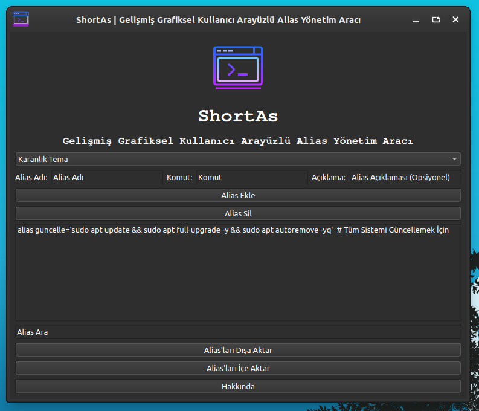
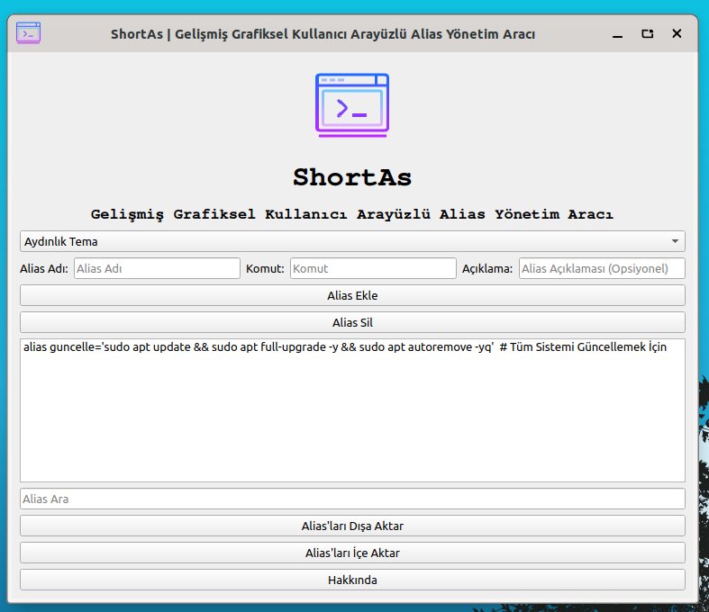

# ShortAs
This application is alias Management Tool with Advanced Graphical User Interface. It helps Linux Users to manage terminal alias easily and securely.

<h1 align="center">ShortAs Logo</h1>

<p align="center">
  
</p>


----------------------

# Linux Dark Screenshot
  

# Linux Light Screenshot
 

--------------------
Install Git Clone and Python3

Github Package Must Be Installed On Your Device.

git
```bash
sudo apt install git -y
```

Python3
```bash
sudo apt install python3 -y 

```

pip
```bash
sudo apt install python3-pip

```

# Required Libraries

PyQt5
```bash
pip install PyQt5
```
PyQt5-sip
```bash
pip install PyQt5 PyQt5-sip
```

PyQt5-tools
```bash
pip install PyQt5-tools
```

Required Libraries for Debian/Ubuntu
```bash
sudo apt-get install python3-pyqt5
sudo apt-get install qttools5-dev-tools
```
----------------------------------


# Installation
Install ShortAs

```bash
sudo git clone https://github.com/cektor/ShortAs.git
```
```bash
cd ShortAs
```

```bash
python3 shortas.py

```

# To compile

NOTE: For Compilation Process pyinstaller must be installed. To Install If Not Installed.

pip install pyinstaller 

Linux Terminal 
```bash
pytohn3 -m pyinstaller --onefile --windowed shortas.py
```

MacOS VSCode Terminal 
```bash
pyinstaller --onefile --noconsole shortas.py
```

# To install directly on Windows or Linux


Linux (based debian) Terminal: Linux (debian based distributions) To install directly from Terminal.
```bash
wget -O Setup_Linux64.deb https://github.com/cektor/ShortAs/releases/download/1.00/Setup_Linux64.deb && sudo apt install ./Setup_Linux64.deb && sudo apt-get install -f -y
```


Release Page: https://github.com/cektor/ShortAs/releases/tag/1.00

----------------------------------
